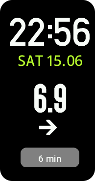

# Zeppos Nightscout Watchface for Amazfit Band 7

Welcome to the repository for the Zeppos Nightscout Watchface, a custom watchface designed for the Amazfit Band 7. This project integrates seamlessly with your Nightscout server to display real-time blood glucose levels directly on your wrist. It's an essential tool for individuals managing diabetes, offering convenience and peace of mind.

### Watchface Screenshot



## Features

- **Blood Glucose Display**: Shows your current blood glucose (BG) level fetched directly from your Nightscout server.
- **Trend Information**: Indicates the direction in which your BG levels are moving.
- **Update Timestamp**: Displays the time elapsed since the last BG data was fetched, ensuring you're aware of the data's freshness.
- **Simplified Interface**: Focuses on the essentials - your BG level, trend, and update time - for clarity and ease of use.

## Background

This project is inspired by and borrows significantly from existing xDrip ZeppOS projects. Special thanks to the developers of the following repositories for their foundational work:

- [WatchDrip Timer WF by 4RK4N](https://github.com/4RK4N/zeppos_watchdrip_timer_wf)
- [WatchDrip Timer WF by bigdigital](https://github.com/bigdigital/zeppos_watchdrip_timer_wf)

Unlike the referenced projects that rely on a local xDrip app, this watchface leverages the Nightscout backend, making your data accessible directly from your Nightscout server without the need for a local intermediary. The focus is on maintaining a lean and straightforward project, prioritizing ease of use and essential functionality.

## Project Structure

This repository consists of two main components:

### 1. Watchface (`/watchface`)
- Custom watchface for Amazfit Band 7
- Displays blood glucose data directly on the watch face
- Built using ZeppOS framework
- Key files:
  - `app.json`: Watchface configuration and metadata
  - `index.js`: Main watchface logic
  - `page/index.js`: Watchface UI implementation

### 2. Companion App (`/app`)
- ZeppOS mini app that runs alongside the watchface
- Handles communication with Nightscout server
- Manages settings and data synchronization
- Key files:
  - `app.json`: App configuration and metadata
  - `app-side/index.js`: Main app logic for phone-side operations
  - `page/index.js`: App UI implementation

### Additional Resources
- `ns_icon*.png`: Various Nightscout icons used in the app
- `icon_240x240.png`: App icon
- `screenshot_wf.png`: Watchface screenshot

## App Settings

Within the Zepp app, you'll find the settings page for this watchface. Here, you can configure the following:

- **Nightscout Host URL**: The web address of your Nightscout server.
- **Access Token**: If your Nightscout server requires an access token, enter it here.
- **Update Interval**: Set how frequently the watchface updates your BG data. Note that more frequent updates may lead to increased battery consumption.

## Getting Started

### Development Prerequisites
1. Install Node.js and npm
2. Install Zeus CLI tool: `npm install -g @zeppos/zeus-cli`
3. Configure your development environment following the [ZeppOS documentation](https://docs.zepp.com/docs/)

### Development Setup
1. Clone this repository
2. Install dependencies:
   ```bash
   # In both /watchface and /app directories
   zeus install
   ```
3. Start development servers:
   ```bash
   # For watchface
   cd watchface
   zeus dev

   # For companion app
   cd app
   zeus dev
   ```

## Installation

The installation process involves two main components: the watchface and the Nightscout companion app. Detailed instructions will be provided in this section on how to install and configure both components to work seamlessly with your Nightscout server.

(Include step-by-step installation and configuration details here.)

## Disclaimer

Please note that this project is still in the experimental phase and may contain bugs. It has not undergone rigorous testing, and its reliability in different scenarios has not been fully validated. Use it at your own risk and discretion.

## Future Plans

- **Further Simplification**: Continued efforts to streamline the codebase, removing unnecessary elements to enhance performance and reliability.
- **Device Support Expansion**: Potential support for additional devices may be considered, contingent upon access to the physical devices for testing and development.

## Contribution

Your contributions, bug reports, and suggestions are welcome! This project is open for collaboration to improve, enhance, and expand its capabilities. Feel free to fork the repository, submit pull requests, or open issues to discuss potential features or report problems.

## Acknowledgements

A heartfelt thank you to the Nightscout community and the developers of the referenced repositories for their foundational work.